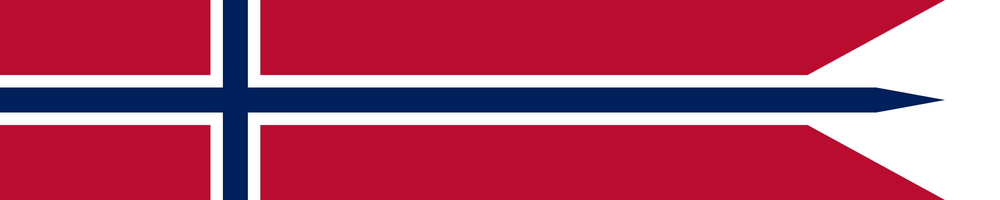

<p>
    
</p>

# FjordJS

### A Norwegian JavaScript transpiler

<br/>

This project is a demo allowing written Norwegian to be converted into JavaScript.

Example:

<table>
<tr>
<th>Norwegian</th>
<th>JavaScript</th>
</tr>
<tr>
<td>
 
```go

La tallet være 99.

Konstant utsagn bruker tall, gjør så 
Konstant mindre er tall minus 1,
Loggfør tall plus
" bottles of beer on the wall\n" plus tall plus
" bottles of beer\ntake one down pass it around\n"
plus mindre plus " bottles of beer on the wall".

Imens tallet overgår 0, så 
utsagn med tallet,
tallet er tallet minus 1.


````

</td>
<td>

```js

let tallet = 99;

const utsagn  = ( tall ) => {
    const mindre = tall - 1;
    console.log(
        tall +
        " bottles of beer on the wall\n" +
        tall +
        " bottles of beer\ntake one down pass it around\n" +
        mindre +
        " bottles of beer on the wall"
    );
};

while ( tallet > 0 ) {
    utsagn ( tallet );
    tallet = tallet - 1;
};
````

</td>
</tr>
</table>
